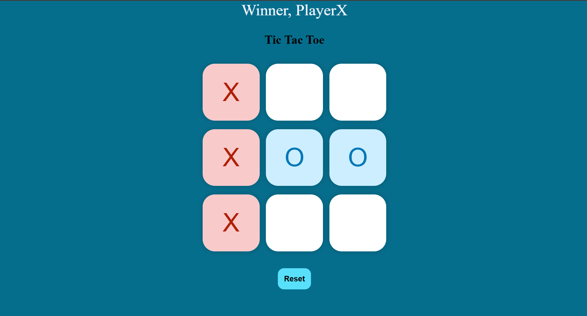

# Tic Tac Toe Game ❌⭕

A classic, interactive 2-player Tic Tac Toe web game built using pure HTML, CSS, and vanilla JavaScript.

<p align="center">
  
</p>

## 🌟 Features
* **Interactive 3x3 Grid:** Smooth turn-based gameplay between Player X and Player O.
* **Winner Detection:** Dynamic heading banner that announces the winner (`Winner, PlayerX`) upon completing a winning combination.
* **Game Reset:** Built-in "Reset" button to restart the game matrix without refreshing the browser.
* **Clean UI:** Distinct color highlights for moves made by 'X' and 'O'.

## 🛠️ Tech Stack
* **HTML5** – Game layout structure.
* **CSS3** – Custom styling, CSS Grid, and color themes.
* **JavaScript (ES6)** – Game logic, DOM manipulation, win-condition checks, and state reset.

## 🚀 How to Run Locally

1. **Clone the repository:**
   ```bash
   git clone [https://github.com/sairaj724/Tic-Tac-Toe-Basic-.git](https://github.com/sairaj724/Tic-Tac-Toe-Basic-.git)
